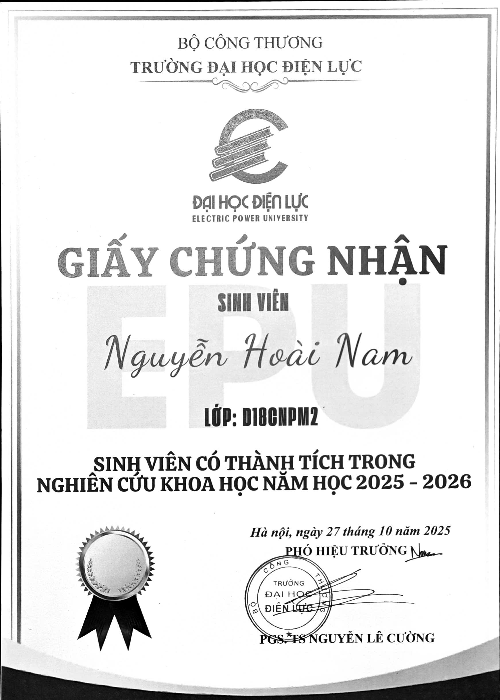
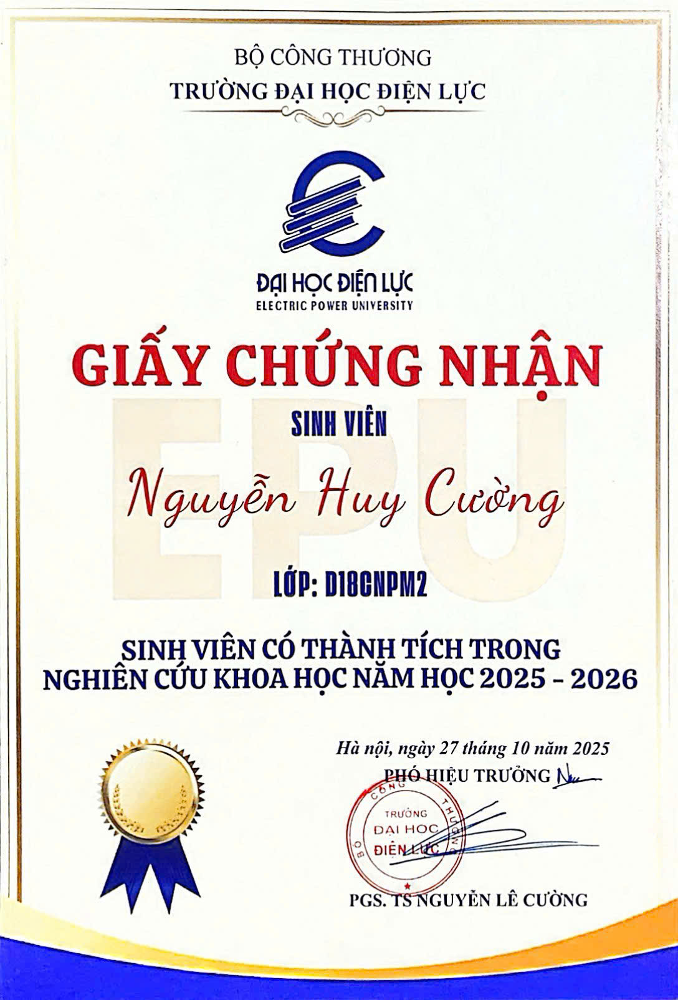
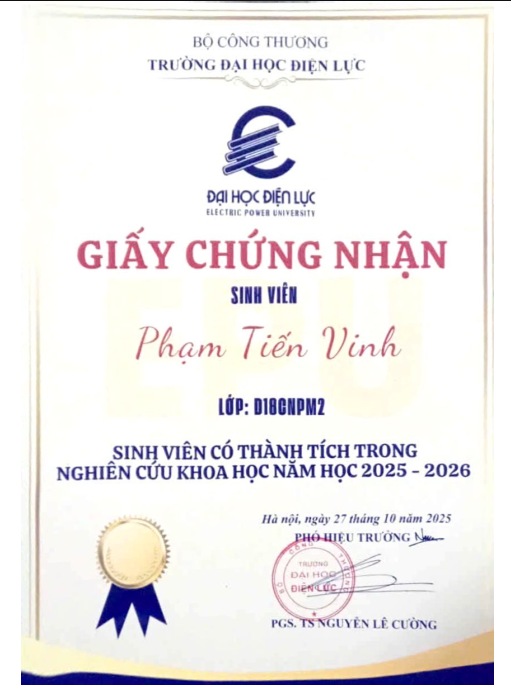

# Tên đề tài

**Nghiên cứu, cấu hình và tùy biến hệ thống thương mại điện tử mã nguồn mở phục vụ bán hàng thời trang**

## Giới thiệu website/hệ thống

Dự án xây dựng hệ thống website thương mại điện tử phục vụ bán hàng thời trang theo mô hình tách riêng Frontend và Backend.

- Frontend: giao diện người dùng và trang quản trị bằng React + Vite.
- Backend: cung cấp REST API bằng Laravel, xử lý xác thực JWT, quản lý sản phẩm, giỏ hàng, đơn hàng và thanh toán.
- Mục tiêu: nghiên cứu, cấu hình và tùy biến hệ thống mã nguồn mở để đáp ứng quy trình bán hàng thời trang thực tế.

## Danh sách thành viên và MSSV

| STT | Họ và tên | MSSV | Lớp |
| --- | --- | --- | --- |
| 1 | Nguyễn Hoài Nam | 23810310082 | D18CNPM2 |
| 2 | Nguyễn Huy Cường | 23810310084 | D18CNPM2 |
| 3 | Phạm Tiến Vinh | 23810310085 | D18CNPM2 |

## Phân công nhiệm vụ cụ thể

| Thành viên | Vai trò | Công việc được phân công |
| --- | --- | --- |
| Nguyễn Huy Cường | Frontend (FE) | Xây dựng giao diện trang chủ, trang sản phẩm, giỏ hàng, thanh toán; kết nối API; tối ưu trải nghiệm người dùng và responsive. |
| Phạm Tiến Vinh | Testing + Seed/Migration | Thiết kế và cập nhật migration; tạo dữ liệu mẫu (seed); kiểm thử API/chức năng, đối chiếu kết quả và ghi nhận lỗi. |
| Nguyễn Hoài Nam | Backend (BE) | Thiết kế kiến trúc backend Laravel; xây dựng API xác thực, quản lý người dùng, sản phẩm, đơn hàng, thanh toán; xử lý middleware và bảo mật hệ thống. |

### Minh chứng thành viên nhóm





## Công nghệ sử dụng

### Backend
- PHP 8.3
- Laravel 13
- JWT Auth (`php-open-source-saver/jwt-auth`)
- Laravel Socialite
- VNPay integration
- MySQL

### Frontend
- React 19
- Vite
- Tailwind CSS 4
- Ant Design
- Axios
- React Router DOM

### Công cụ hỗ trợ
- Composer
- npm
- ESLint
- Laravel Pint
- PHPStan
- PHPUnit

## Hướng dẫn cài đặt

### 1) Clone source code

```bash
git clone <repo-url>
cd pmmnm
```

### 2) Cài đặt Backend

```bash
cd PMMNM/backend-laravel
composer install
cp .env.example .env
php artisan key:generate
php artisan migrate --seed
```

### 3) Cài đặt Frontend

```bash
cd ../frontend
npm install
cp .env.example .env
```

## Hướng dẫn chạy project

### Cách 1: Chạy bằng script

Từ thư mục `PMMNM`, chạy file:

```bat
start-dev.bat
```

Script sẽ tự động:
- chạy Backend tại `http://127.0.0.1:8080`
- chạy Frontend tại `http://localhost:5173` (hoặc 5174 nếu 5173 đang bận)

### Cách 2: Chạy thủ công

Backend:

```bash
cd PMMNM/backend-laravel
php artisan serve --host=127.0.0.1 --port=8080
```

Frontend:

```bash
cd PMMNM/frontend
npm run dev
```

## Tài khoản demo

Đã cập nhật seed demo từ `ltwnc` sang `pmmnm` cho tài khoản sử dụng trong quá trình nghiệm thu:

| Loại tài khoản | Email | Mật khẩu | Quyền |
| --- | --- | --- | --- |
| Admin | admin@pmmnm.tech | Admin@123 | ADMIN |
| User | user@pmmnm.tech | User@123 | USER |

Ghi chú:
- Nếu đã seed dữ liệu cũ, cần rollback và seed lại để đồng bộ tài khoản demo mới.
- Có thể tạo thêm user mẫu khác từ `user2@pmmnm.tech` đến `user5@pmmnm.tech` với mật khẩu `User@123`.

## Hình ảnh minh họa hệ thống

### Giao diện người dùng


### Giao diện quản trị


## Link video demo
- Google drive: https://drive.google.com/file/d/1-oRNk5hiqfe8b28RxBI5WTZTKRkcmUz9/view?usp=sharing

## Link online đã deploy

- Website: https://hnamofficial.id.vn
- API base URL: https://api.hnamofficial.id.vn

